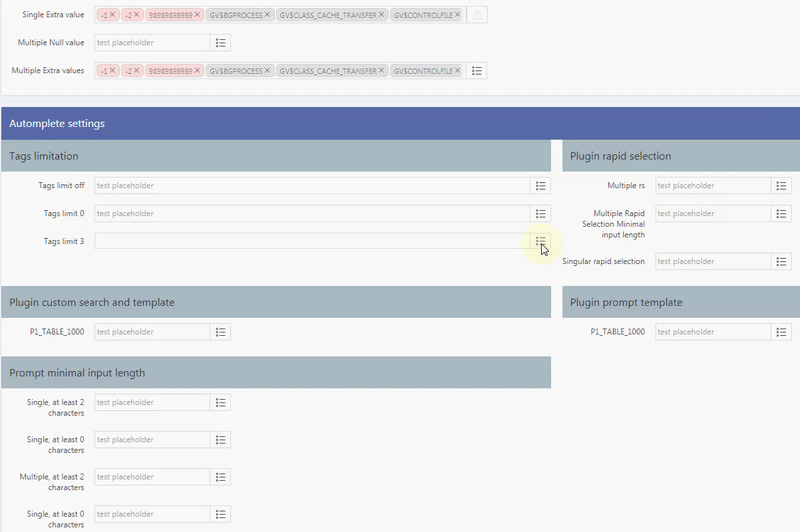
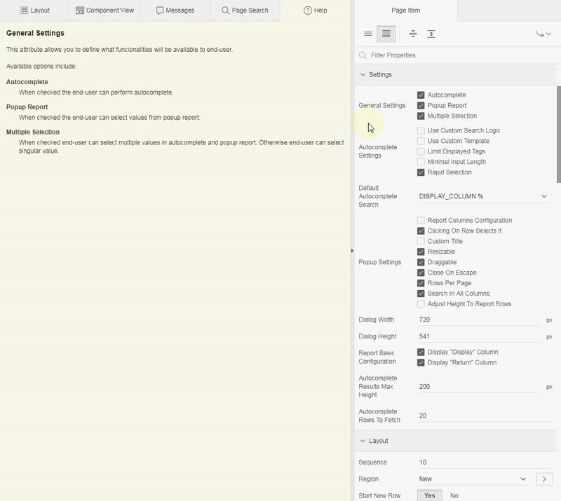

# Pretius APEX Enhanced LOV item

Pretius APEX Enhanced LOV item is powerful combobox to select singular / multiple values in two modes: autocomplete and popup report. The plugin provides high customization possibilities through its attributes.

## Preview



## Table of Contents

- [License](#license)
- [Demo Application](#demo-application)
- [Features at Glance](#features-at-glance)
- [Roadmap](#roadmap)
- [Install](#install)
  - [Installation package](#installation-package)
  - [Install procedure](#install-procedure)
- [Usage Guide](#usage-guide)
- [Plugin Settings](#plugin-settings)
  - [Attributes](#component-settings)
  - [Plugin Events](#plugin-events)
  - [Translations](#translations)
- [Changelog](#changelog)


## License
MIT

## Demo Application
[https://apex.oracle.com/pls/apex/f?p=111865:1](https://apex.oracle.com/pls/apex/f?p=111865:1)


## Features at Glance
* compatible with Oracle APEX 5.1, 18.x, 19.x
* The plugin has two modes: Autocomplete and popup report
* Autocomplete custom filtering rules can be defined as SQL where clause
* Autocomplete can render data in custom HTML template returned from JavaScript annonymouse function
* Popup report columns can be configurable: sorting, filtering, aligment and heading text
* The plugin texts are translatable

## Roadmap
* [ ] RTL support
* [x] Floating label template (since v1.1.0)
* [ ] Mobile devices support
* [ ] Show only selected in autocomplete mode
* [x] Support for pasting values (for example from Excell file) (since v1.1.0)
* [ ] Different types of pagination in popup report
* [ ] Creating new values in autocomplete mode
* [ ] Oracle APEX Theme roller integration
* [ ] Keyboard shortcuts
* [ ] Highlighting search term in autocomplete
* [ ] Columns order configurable in JSON
* [x] Interactive GRID support (since v1.1.0)


## Install

### Installation package
* `APEX_ENHANCED_LOV_ITEM.sql` - the plugin package specification
* `APEX_ENHANCED_LOV_ITEM.plb` - the plugin package body
* `item_type_plugin_pl_ostrowskibartosz_apex_enhancedlovitem.sql` - the plugin installation file for Oracle APEX 5.1 or higher
* `example_app.sql` - the plugin example app exported from apex.oracle.com (Oracle APEX 19.1). Application uses `emp` table which is available at apex.oracle.com.

### Install procedure
To successfully install the plugin follow those steps:
1. Install package `APEX_ENHANCED_LOV_ITEM` in Oracle APEX Schema
1. Install the plugin file `item_type_plugin_pl_ostrowskibartosz_apex_enhancedlovitem.sql`

## Usage Guide

1. Create APEX item `PX_NAME` with type set to `APEX Enhanced LOV Item [Plug-in]`
1. Provide SQL query and mark `display` column with alias `d` and `return` column with alias `r` *
1. Explore the plugin capabilities by reading Help Texts within APEX Application Builder
1. Configure the plugin according to your requirements  

`*` the plugin uses aliases `d` and `r` to recognize which column should be returned and which is general display column. Don't use aliases enclosed with quote character! See example below:

```sql
select
  e.empno r,
  e.ename d,
  e.*
from
  emp e
```

## Plugin Settings

### Attributes

Detailed information about how to use every attribute of the plugin is presented in built-in help texts in APEX Application Builder.



* **General Settings**
  * **Autocomplete** - autocomplete mode is available to end-user
  * **Popup report** - popup report mode is available to end-user
  * **Multiple Selection** - when checked the plugin allows to select multiple values in selected modes

* **Autocomplete Settings**
  * **Use Custom Search Logic**
    * (when not checked) **Default Autocomplete Search** - Select list with 12 options
    * (when checked) **Custom Search Logic** - SQL where clause to be defined by developer
  * **Use Custom Template**
    * (when checked) **Custom Autocomplete Template** - annonymouse JavaScript returning HTML template for each row
  * **Limit Displayed Tags**
    * (when checked) **Number Of Tags** - number of tags (values) to be presented before wrapping others tags in summary tag
  * **Minimal Input Length**
    * (when checked) **Minimal Input Length** - minimal number of characters to be provided by end-user before performing autocomplete search
  * **Rapid Selection** - when checked then user is able to select value from list and write next phrase to search for. When unchecked in singular selection mode it automatically close autocomplete.

* **Popup Settings**
  * **Report Columns Configuration**
    * (when checked) **Report Columns Configuration** - JSON object describing visibility, heading text, sorting, fitlering for each column of popup report
  * **Clicking On Row Selects It** - when checked, end user is able to select values by clicking on row in popup report
  * **Custom Title**
    * (When checked) **Custom Title** - text to be used as title for popup report dialog
  * **Resizable** - when checked, the popup report dialog is resizable by end-user
  * **Draggable** - when checked, the popup report dialog is draggable by end-user
  * **Close On Escape** - when checked, the popup report can be closed by pressing `Escape` key
  * **Rows Per Page** - when checked, end user can force report to show particular number of rows
  * **Search In All Columns** - when checked, end-user is able to filter popup report through all columns
  * **Adjust Height To Report Rows**
    * (when not checked) **Dialog Height** - popup report dialog has static height given by developer
    * (when checked) popup report adjusts dialog height to result rows

* **Report Basic Configuration**
  * **Display "Display" Column** - when checked, column with alias `d` is rendered in popup report
  * **Display "Return" Column** - when checked, column with alias `r` is rendered in popup report

* **Dialog Width** - popup report dialog has static with given by developer

### Plugin Events
#### Atucomplete

* **Autocomplete closed** - Triggered each time autocomplete is closed.
* **Autocomplete data appended** - Triggered each time new data is being loaded after scrolling autocomplete results/
* **Autocomplete data rendered** - Triggered each time first set of data is being rendered
* **Autocomplete error** - Triggered each time autocomplete has error
* **Autocomplete open** - Triggered each time autocomplete is beind opened

Each autocomplete event has access through this.data to following information:

```javascript
{
  "prompt": {
    "container": jQuery object, //autocomplete container
    "header"   : jQuery object, //autocomplete header with action menu
    "body"     : jQuery object, //autocomplete body containing rendered data
    "input"    : jQuery object  //autocomplete search input
  },
  "mask": {
    "selected"     : Array,  //array of already selected data
    "dataAvailable": Boolean //boolean value indicates whether there is data to render
  }
};
```

#### Popup report
* **Popup report closed** - Triggered each time popup report is closed
* **Popup report data rendered** - Triggered each time the popup report renders set of data
* **Popup report error** - Triggered each time the popup report has error
* **Popup report open** - Triggered each time the popup report is opened

Each popup report event has access through this.data to following information:
```javascript
{
  "header"       : jQuery Object, //reference to container for global search, rows per page and pagination
  "container"    : jQuery Object, //reference to parent container of popup report
  "body"         : jQuery Object, //reference to body container of popup report
  "footer"       : jQuery Object, //reference to container for Show only selecte and button Select
  "pagination"   : jQuery Object, //reference to container for pagination
  "search"       : jQuery Object, //reference to input performing search in all columns
  "rowsPerPage"  : jQuery Object, //reference to select list
  "contentTable" : jQuery Object, //reference to result table of data currently rendered
  "state"        : {
    "selected"              : Array,  //Array of currently selected values in popup
    "searchString"          : String, //Currently provided search string
    "searchColumnIdx"       : Number, //Index (starting from 1) of column in SQL Query
    "sortedColumnIdx"       : Number, //Index (starting from 1) of column in SQL Query
    "sortedColumnDirection" : String, //String "asc" / "desc"
    "ajaxRunning"           : Boolean //If true then AJAX is currently running
  }
};
```

### Translations

To add new translations use `Shared Componentes> Globalization > Text Messages`.

Translation code | Translation text
-----------------|-----------------
PAELI_POPUP_SEARCH_PLACEHOLDER | Enter a search term
PAELI_POPUP_BTN_SELECT_TEXT | Select
PAELI_POPUP_SHOW_SELECTED_LABEL | Show only selected
PAELI_POPUP_TEXT_ROWS_SELECTED | All results (%0) on this page has been selected.
PAELI_POPUP_TEXT_NO_DATA_FOUND_SEARCH | No data found for search term "%0".
PAELI_POPUP_TEXT_NO_DATA_FOUND_QUERY | Dictionary has no data to render.
PAELI_POPUP_TEXT_CLEAR_FILTERING | Click <a href="javascript: void(0)" class="clearFiltering">here</a> to clear filtering.
PAELI_POPUP_TEXT_UNSAVED_CHANGES | You have selected %0 values. Closing without saving will not save selected values.
PAELI_POPUP_TEXT_SEACH_IN_SELECTED | You have filtered %0 row(s) from %1 selected row(s). <br/>Click <a href="javascript: void(0)" class="showSelected">here to get back to all selected rows.
PAELI_POPUP_TEXT_FILTERED_INFO | %0 results found for search term "%1".
PAELI_POPUP_TEXT_EXTRA_VALUE | Value "%0" is not within dictionary.
PAELI_PROMPT_MENU_EXPAND_TITLE | Show or hide all tags
PAELI_PROMPT_MENU_SORT_TITLE | Sort tags
PAELI_PROMPT_MENU_CLEAR_TITLE | Clear all selected values
PAELI_PROMPT_TEXT_MINIMAL_INPUT_LENGTH_X | Please enter %0 or more characters.
PAELI_PROMPT_TEXT_MINIMAL_INPUT_LENGTH_0 | Start typing to get results.
PAELI_PROMPT_TEXT_NO_DATA_FOUND | No data found.
PAELI_PROMPT_TEXT_SEARCHING | Searching...
PAELI_PROMPT_TEXT_RAPID_SELECTION | Start typing to select more...
PAELI_PROMPT_TEXT_LOAD_MORE | Load more...
PAELI_TAGS_LIMITED_OTHERS | and %0 more...
PAELI_TAGS_LIMITED_0 | %0 selected
PAELI_POPUP_PAGINATION_PREV | Previous
PAELI_POPUP_PAGINATION_NEXT | Next
PAELI_POPUP_PAGINATION_OF | of
PAELI_POPUP_HEADER_SORT_ASC_TITLE | Sort ascending
PAELI_POPUP_HEADER_SORT_DESC_TITLE | Sort descending
PAELI_POPUP_TEXT_SEARCHING | Waiting for results...

## Changelog

### 1.1.0

#### New functionalities
* Possibility to paste list of values (ie. from excel column)
  * new translation texts were added (see translation texts table)
* Interactive Grid is supported

#### Enhancments
* Possibility to open popup report from autocomplete menu

#### APEX Integration
* Floating template is supported

#### JavaScript
* Code have been refactored
* Debug messages are divided to each level

#### Bugs fixed
* [#7](/../../issues/7) inline dialog bug is fixed . Item prompt is no longer hidden behind inline dialog,
* [#12](/../../issues/12) Loading display value for item session state on `Page load` has been fixed.,
* [#14](/../../issues/14),[#15](/../../issues/15), [#20](/../../issues/20) Cascading LOV funcionality has been fixed and now supports multiple parent items,
* [#17](/../../issues/7) focus issues are fixed
* missing translation text `PAELI_POPUP_PAGINATION_OF` for pagination is now supported
* `order by` clause in provided SQL Query is no longer removed. It fixes bug `ORA-00907: missing right parenthesis` when aliases `d`, `e`, `c`, `o` has been used in `order by` clause,
* `Warn On Unsaved Changes` is supported,
* item value is printed using `htp.prn` instead of `htp.p`. No new line `\n` character added to item value attribute at the end of string,

#### General
* component name changed from `APEX Enhanced LOV Item` to `Pretius APEX Enhanced LOV Item`

#### PL/SQL
* Code have been refactored
* Debug via APEX Debugger is now available


### 1.0.4
* `PL/SQL` all strings inputed via search field is being escaped using ```APEX_ESCAPE.HTML``` - fix for potential XSS
* `PL/SQL` value from session on page load is being escaped using ```APEX_ESCAPE.HTML``` - fix for potential XSS
* `PL/SQL` Rows in which `r` columns is null is not available in `autocomplete` and `popup` mode - value in column `r` must be unique and can't be null
* `JS` Typo in `PAELI_POPUP_TEXT_ROWS_SELECTED` has been fixed
* `Example application` supporting objects has been updated (install script fixed, deinstall script created)


### 1.0.3
* `Plugin` `Rapid Selection` attribute is now dependent on the plugin selection mode (multiple / singular). In singular selection unchecked `Rapid Selection` attribute results in closing autocomplete after selecting value,
* `Plugin` `Custom Autocomplete Template` attribute help text has been updated with reference to `this.data.selected` which indicates that particular row is already selected by end-user,
* `Plugin` new component attribute `Autocomplete Rows To Fetch` is available to define,
* `Plugin` new component attribute `Autocomplete Results Max Height` is available to define,
* `Plugin` in case of new component attributes new translatable text `PAELI_PROMPT_TEXT_LOAD_MORE` is now available.
* `PL/SQL` autocomplete pagination (lazy loading) has been fixed to return given number of rows (previously it was duplicating last row from requested set of data)
* `JavaScript` the plugin mask (apex item visualization) is focusable and support `keypress` and `keydown` events when focused. 
  * pressing `Down Arrow Key` results in opening autocomplete
  * pressing any letter key results in opening autocomplete and peforming search

### 1.0.1, 1.0.2
minor fixes for first release

### 1.0.0 
Initial Release

## Known issues
* [Inline dialog bug](https://github.com/bostrowski/APEX-Enhanced-Lov-Item/issues/7)

## About Author
Author | Github | Twitter | E-mail
-------|--------|---------|-------
Bartosz Ostrowski | [@bostrowski](https://github.com/bostrowski) | [@bostrowsk1](https://twitter.com/bostrowsk1) | bostrowski@pretius.com

## About Pretius
Pretius Sp. z o.o. Sp. K.

Address | Website | E-mail
--------|---------|-------
Przy Parku 2/2 Warsaw 02-384, Poland | [http://www.pretius.com](http://www.pretius.com) | [office@pretius.com](mailto:office@pretius.com)

## Support
Our plugins are free to use but in some cases you might need to contact us. We are willing to assist you but in certain circumstances you will be charged for our time spent on helping you. Please keep in mind we do our best to keep documentation up to date and we won't answer question for which there is explaination in documentation (at github and as help text in application builder).

All request (bug fix / change request) should be posted in Issues Tab at github repository.

### Free support
We do support the plugin in certain cases such as bug fixing and change request. If you have faced issue that might be bug please check Issues tab in github repository. In case you won't be able to find related issue please raise the issue following these rules:

* issue should contain login credentials to application at apex.oracle.com where issue is reproduced
* issue should contain steps to reproduce the issue in demo application
* issue should contain description about it's nature

### Paid support
In case you are not able to implement the plugin or you are willing to have custom implementation based on the plugin attributes (ie. custom JavaScript callbacks) we are willing to help you. Please send inquiry to apex[at]pretius.com with description what you want us to help you with. We will contact you as soon as possible with pricing and possible dates.
